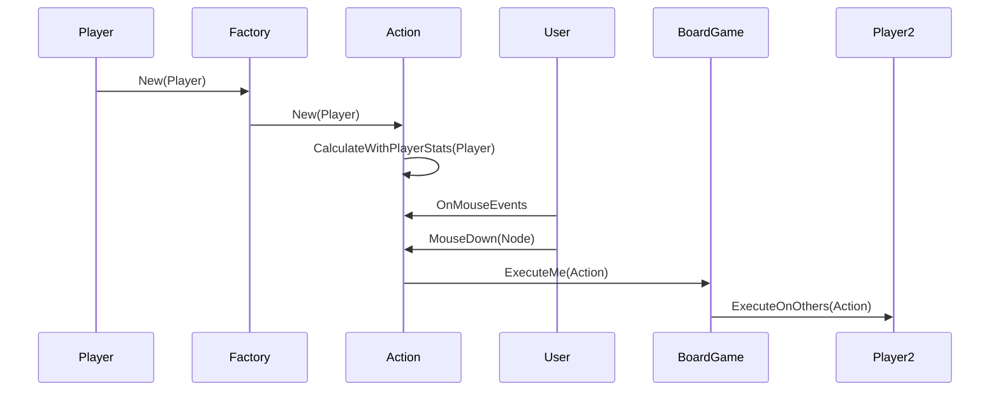

El action debe tener una forma de decir, ejecutame paso a paso;

AttackAction: List<ActionSteps>{
	new Attack()
	{
		Attacker = ;
		Defender = ;
		Damage = ;
	}
	new Attack(AttackData);
}

	SendMeToBoard(List<Steps>);
	
Move: List<ActionSteps>{
	new Move()
	{
		From = ;
		To = ;
	}
};
	
	-- BoardAgent --
SimpleAttackExecuter(List<AttackSteps>){
	
	}
	