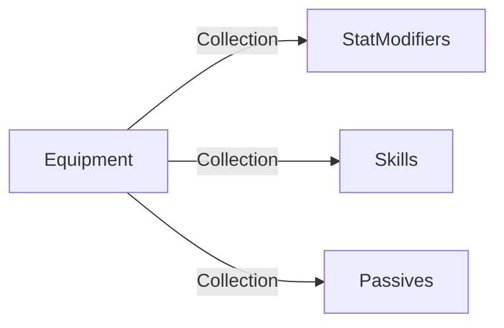

## Equipment



Equipments can have Stat Modifiers (+1 hp), active Skills  (attack for 1) and Passives (On Kill gain 1 health)


### Active Skill
Skills can be interacted with by the player through Inputs

```cs
class Skill{
	public void OnSkillHover();
	public void OnSkillExitHover();
	public void OnSkillActivate();
	public void OnSkillCancel();
	public void OnNodeEnter(Node node);
	public void OnNodeExit(Node node);
	public void OnNodePress(Node node);
}
```

```cs
class SimpleAttackSkill{
	public void OnSkillHoverEnter(){
		player.ShowRange(range);
	}
	public void OnSkillHoverExit(){
	//is this necessary?
		player.ResetRange();
	}
	public void OnSkillActivate(){
		selectingTarget = true;
		player.RequestTarget(1, singleTarget);
	}
	public void OnSkillCancel(){
		selectingTarget = false;
	}
	public void OnNodeEnter(Node node);
	public void OnNodeExit(Node node);
	public bool OnNodePress(Node node){
		if(node.occupant == null) 
			return true;
		if(node.occupant.faction == enemy){
			doDamage(node.occupant);
			return true;
		} 
		return false;
	}
}
```

### Passive Skills (for later dev)


```cs
enum PassiveActivationType{
	OnStageStart,
	OnStageEnd,
	OnTurnStart,
	OnTurnEnd,
	OnReceiveDamage,
	OnDealDamage,
	OnReceiveHeal,
	OnDealHeal,
	OnAttack,
	OnSkillActivate,
	OnManaSpend,
	OnMove,
	etc
}
```

```cs
class Retaliate : Passive {
	PassiveActivationType type = OnReceiveDamage;
	public void Trigger(CombatLog log){
		DealDamage(log.enemy);
	}
}
```