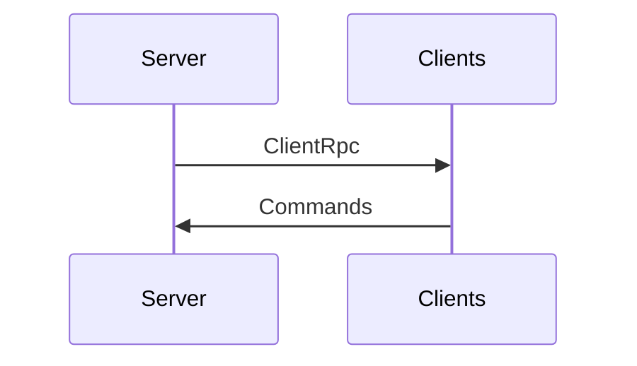

Client needs only to have authority of PlayerNetworkController which binds to the UI and sends commands to the server.

PlayerNetworkController controlls:
	Joining a game
	Picking a class
	Ready Up
	Picking Rewards
	